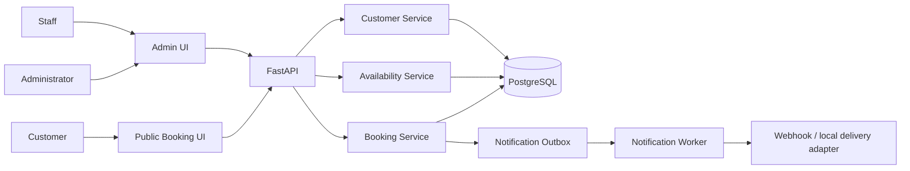
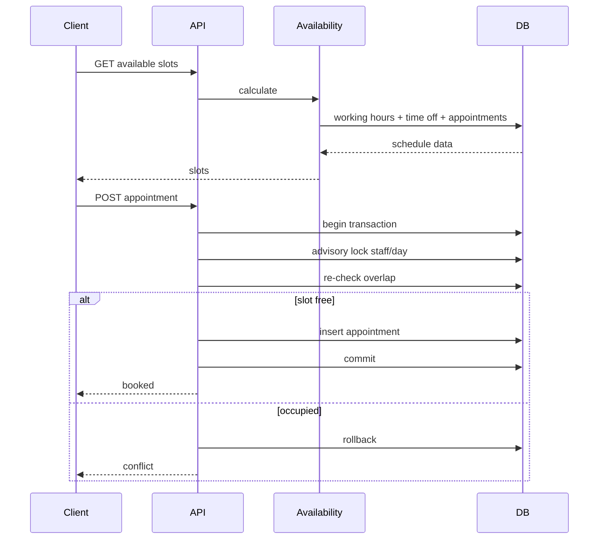
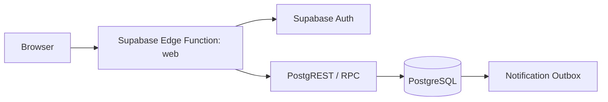

# Архитектура Lootly Booking Platform

## Context

## Domain boundaries

### Organization
Tenant root.

### Location
Физический/виртуальный филиал. Хранит timezone.

### Staff
Исполнитель услуги.

### Service
Название, duration, price, active flag.

### StaffService
Связь many-to-many, определяющая доступность услуги у сотрудника.

### WorkingHours
Регулярное расписание сотрудника по дню недели.

### TimeOff
Исключения: отпуск, перерыв, блокировка времени.

### Customer
Карточка клиента и история визитов.

### Appointment
Фактическая запись. Содержит snapshot duration/price.

## Booking sequence

## Time model

- Location.timezone: IANA identifier, e.g. Europe/Moscow.
- WorkingHours хранится как local wall-clock time + weekday.
- Appointment хранится в UTC.
- Availability сначала строится в local timezone, затем переводится в UTC.

## Scaling

Первый этап — modular monolith.

Масштабирование:
- несколько API replicas;
- PostgreSQL как consistency authority и notification outbox;
- shared rate limiter (Redis/API gateway) перед горизонтальным масштабированием public API;
- отдельные workers для уведомлений.

Не выделять микросервисы до измеренной необходимости.

## Future modules

- payment;
- loyalty;
- group sessions;
- resources/rooms;
- waitlist;
- advanced analytics;
- integrations.

## Supabase free production architecture

The active public deployment is serverless:

Booking concurrency is enforced in PostgreSQL with a GiST exclusion constraint for active
appointments. Public clients never receive database secrets; they use the publishable key and only
narrow public RPC functions. Administrative table access is restricted by RLS.
