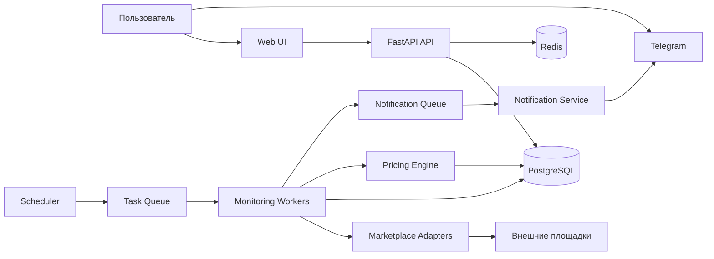
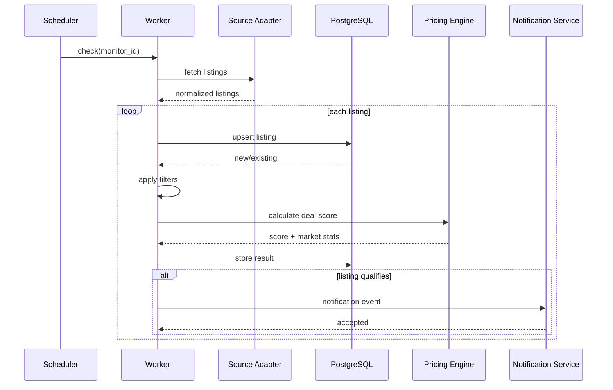

# Архитектура Lootly

## 1. Цель архитектуры

Архитектура должна поддерживать быстрый мониторинг объявлений, фильтрацию, оценку выгодности и отправку уведомлений, оставаясь независимой от конкретного источника данных.

## 2. Контекстная схема

## 3. Поток обработки объявления

## 4. Компоненты

### Web UI
Пользовательская панель:
- мониторинги;
- результаты;
- история;
- настройки Telegram.

### API
Единая точка доступа для frontend и внешних клиентов.

### Scheduler
Создает задачи проверки только для активных мониторингов.

### Source Adapter Layer
Интерфейс:
- validate_monitor();
- fetch_listings();
- normalize_listing();
- get_source_capabilities().

Каждый источник реализует один и тот же контракт. Перед регистрацией adapter обязан пройти fail-closed source compliance gate; см. `docs/SOURCE_COMPLIANCE.md`.

### Monitoring Worker
Оркестрирует:
- загрузку;
- нормализацию;
- дедупликацию;
- фильтрацию;
- сохранение;
- вызов pricing;
- генерацию события уведомления.

### Pricing Engine
На MVP:
- медианная цена;
- процент отклонения от медианы;
- минимальный размер выборки;
- защита от выбросов.

В дальнейшем:
- модели по категории;
- состояние товара;
- временной тренд;
- регион;
- seller reputation.

### Notification Service
Каналы:
- Telegram в MVP;
- email/push/webhook позже.

## 5. Границы ответственности

Нельзя смешивать:
- извлечение данных и бизнес-правила;
- Telegram formatting и pricing;
- API CRUD и polling;
- source-specific код с core domain.

## 6. Масштабирование

Горизонтально масштабируются:
- workers;
- notification workers;
- API replicas.

Scheduler должен обеспечивать отсутствие дублей задач через distributed lock или эквивалентный механизм.

## 7. Наблюдаемость

Необходимые метрики:
- checks_total;
- checks_failed_total;
- listings_seen_total;
- listings_new_total;
- notifications_sent_total;
- source_latency_seconds;
- processing_latency_seconds;
- queue_depth;
- worker_failures_total.

## 8. Архитектурные принципы

1. Adapter-first для внешних площадок.
2. Idempotency by default.
3. Queue-based background processing.
4. Explicit domain boundaries.
5. Observability from day one.
6. No anti-bot circumvention as a system requirement.

## 9. High-frequency distributed polling

Для разрешенных источников Lootly поддерживает три очереди мониторинга:

- `monitoring-realtime` — интервалы до 1 секунды;
- `monitoring-fast` — интервалы от 1 до 5 секунд;
- `monitoring` — интервалы свыше 5 секунд.

Scheduler использует PostgreSQL `FOR UPDATE SKIP LOCKED`, поэтому несколько экземпляров scheduler могут
распределенно забирать due-monitorings без двойного claim. Повторная обработка дополнительно защищена
Redis-lock на monitor id.

Минимальный программно поддерживаемый интервал — 500 мс. Реальный минимальный интервал для конкретного
источника обязан учитывать его документированные лимиты и `SourceAccessPolicy`. Этот механизм не разрешает
обход rate limits, CAPTCHA или антибот-защиты.
